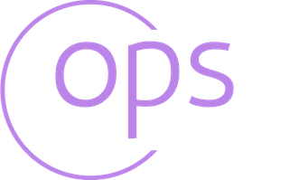

# Contributing

## Prerequisites

**Install build and runtime dependencies**

- mac
```bash
brew install make go libpcap git
```

- debian
```bash
sudo apt update && sudo apt install -y make golang libpcap-dev git
```

When building from source you may want to add the following lines to one of your
rc files to add your user's go bin to the PATH variable.

```bash
export GOPATH="$HOME/go"
PATH="${GOPATH}/bin:$PATH"
```

**Install test dependencies**

```bash
make deps
```

## Test

Mocks are generated using the `//go:generate` directive. Any
file that contains an interface that you would like to mock
should contain a go generate comment directive at the top of
the file. Mocks will then be generated via `make mock`

i.e.

```go
// config/interface.go
package config

//go:generate mockgen -destination=../mock/config/mock_config.go -package=mock_config . Repo,Service
```

- Generate mocks

```bash
make mock
```

- Run tests

```bash
make test
```

## Build

```bash
make ops

# build development version that detects race conditions
make dev
```

## Run

```bash
sudo ./build/ops

# run development build
sudo ./build/ops-dev

# or run using go run
sudo go run main.go

# you can also add --debug to any of the run commands above to run a
# non-UI version of the app that just prints logs to the terminal
sudo go run main.go --debug
```

- clear config file and log file

```bash
./build/ops clear
```
